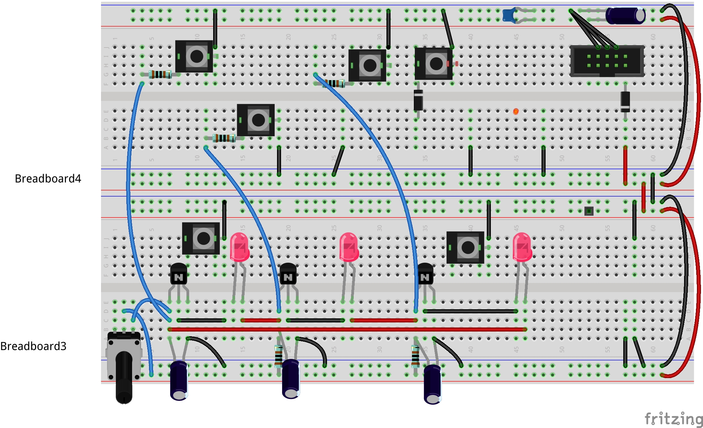
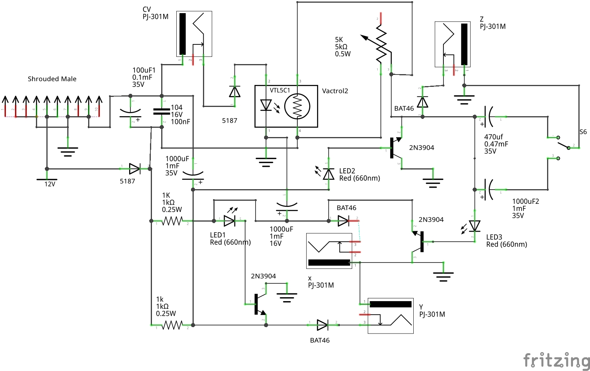
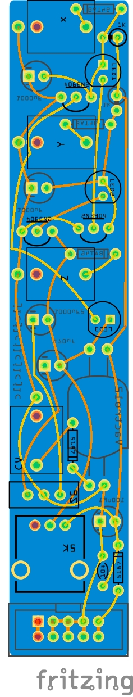
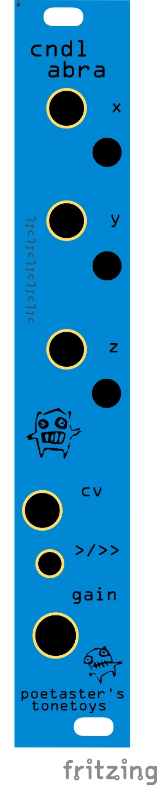

# candelabra
Candelabra is a fritzing project and PCB gerbers for a Eurorack chaos CV generator using rotating color LEDs.

This circuit owes it's existance to a number of sources on chaotic circuits. But the spark that got it really going is from:
https://cpldcpu.com/2020/06/15/building-a-chaotic-oscillator/

