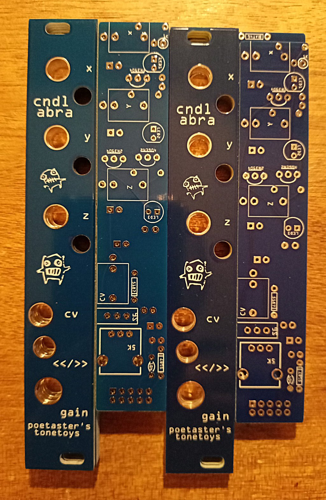

# candelabra
Candelabra is a fritzing project and PCB gerbers for a Eurorack chaos CV generator using rotating color LEDs.

This circuit owes it's existance to a number of sources on chaotic circuits. But the spark that got it really going is from:
https://cpldcpu.com/2020/06/15/building-a-chaotic-oscillator/

Prototypes were made with the kind assistance of https://www.pcbway.com
 The technicians were very astute and helpful and turnaround time was quick. 
The quality of the lithography was high with sharp readable figures and text. Can recomend!

As one can see from these not so sharp photos, the JLC boards are slightly lighter blue than the pcbway ones, but both have high quality finish.

